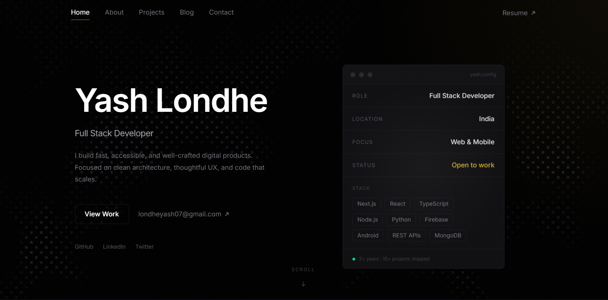

  <h1>Personal Portfolio</h1>
  <a href="https://portfolio-hazel-one-92.vercel.app/">
    <!-- 📸 Replace the src below with your actual screenshot path (e.g., ./public/preview.png) -->
    
  </a>

 

Welcome to my digital space. This portfolio is a curated showcase of my journey as a developer, highlighting my latest projects, technical writing, and professional achievements. 

Built with a strong focus on performance and high-end design, the site leverages modern web technologies including Next.js, Framer Motion, and Tailwind CSS. A standout feature is the custom WebGL procedural "Pixel Beams" shader built with Three.js, which creates an immersive, interactive 3D background that responds to user input.

Beyond aesthetics—such as the premium glassmorphism styling and subtle noise textures—this platform demonstrates my commitment to creating responsive and dynamic user experiences. It features smooth page transitions, interactive mock browser previews for projects, and a fully functional contact system.
